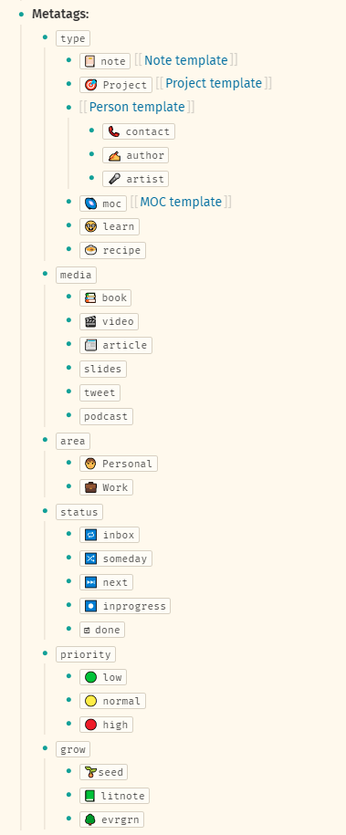
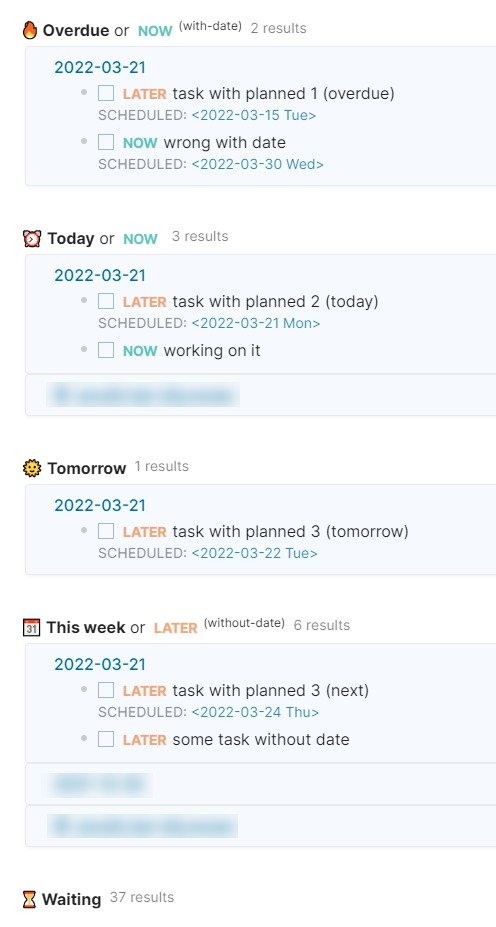
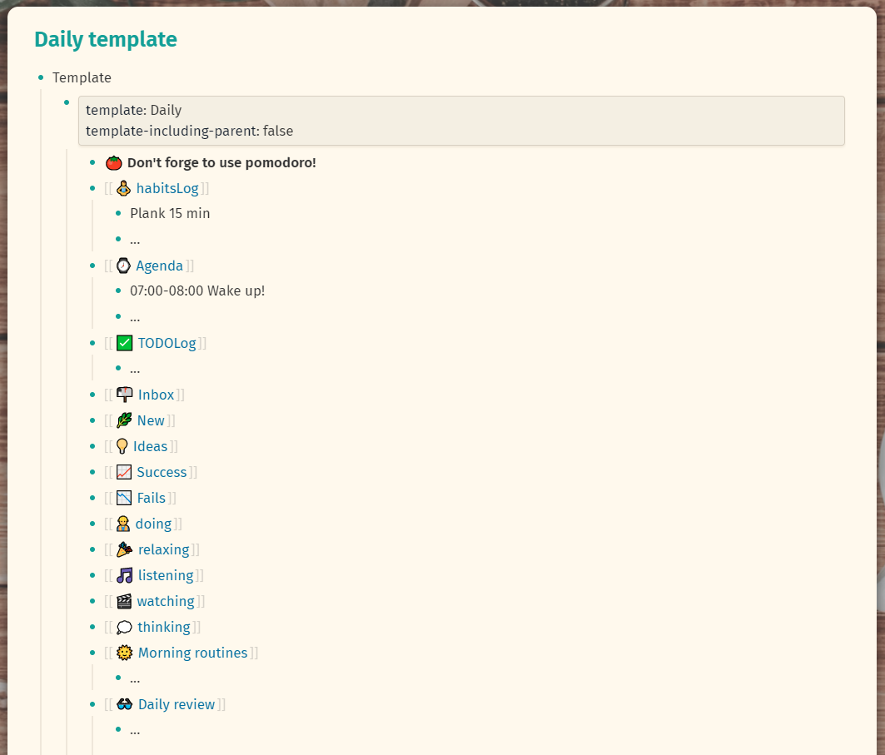
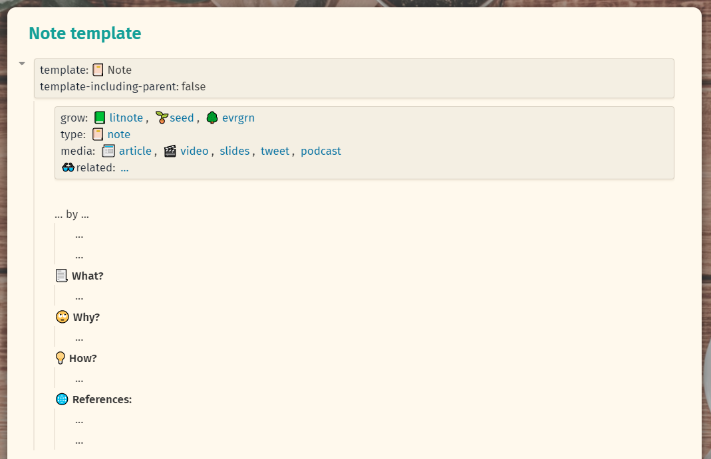
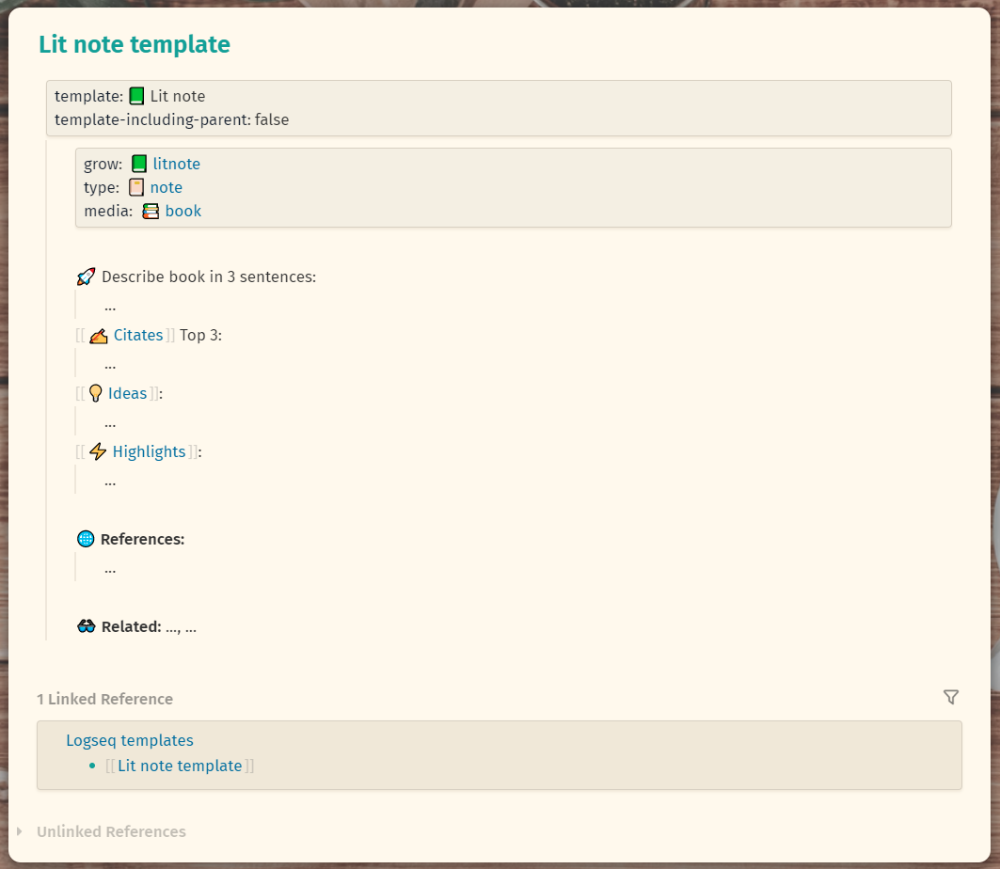
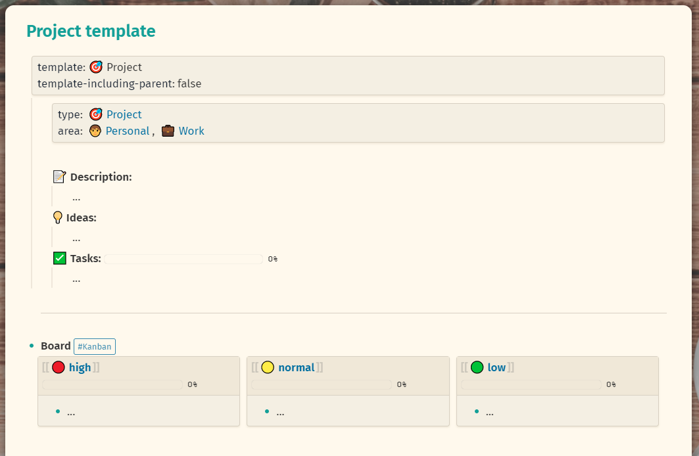
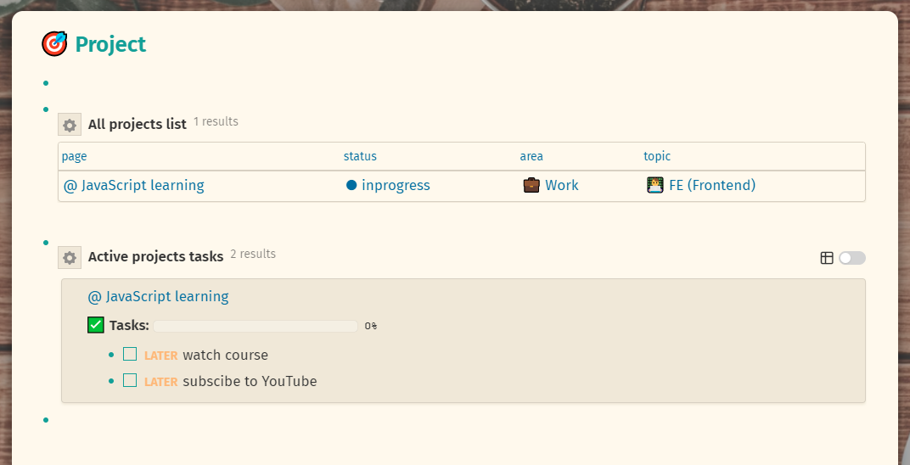
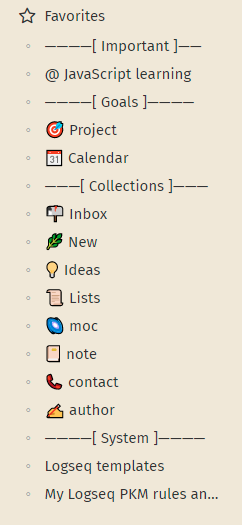

## Starter pack for Logseq
🚀 Collections of my templates, queries for journal page, pages meta, projects dashboard and sidebar view.
Download, open new graph in Logseq, explore/inspire/experiment!
Hope it will be useful for somebody...

* Sidebar separators
* Templates
    * [Note](pages/Note%20template.md)
    * [Litnote](pages/Lit%20note%20template.md)
    * [Person](/pages/Person%20template.md)
    * [Project](/pages/Project%20template.md)
    * [Daily](/pages/Daily%20template.md)
* [Meta (page properties) for different pages](pages/My%20Logseq%20PKM%20rules%20and%20workflow.md)
* Pages with queries for every note type ([for ex "litnote"](pages/%F0%9F%93%97%20litnote.md))
* [Projects dashboard](pages/%F0%9F%8E%AF%20Project.md)
* [Daily TODO queries](https://github.com/yoyurec/logseq-starter-graph/blob/main/logseq/config.edn#L113-L223)

## If you ❤ what i'm doing - you can support my work! ☕

<!-- -  -->

## Screenshots

## Recommended theme
* [Solarized extended theme for Logseq](https://github.com/yoyurec/logseq-solarized-extended-theme)

## Recommended plugins
* [TODO Master](https://github.com/pengx17/logseq-plugin-todo-master)
* [TOC Generator](https://github.com/sethyuan/logseq-plugin-tocgen)

## What is Logseq?
Logseq is a privacy-first, open-source knowledge base. Visit https://logseq.com for more information.

## License

[MIT License](./LICENSE)
